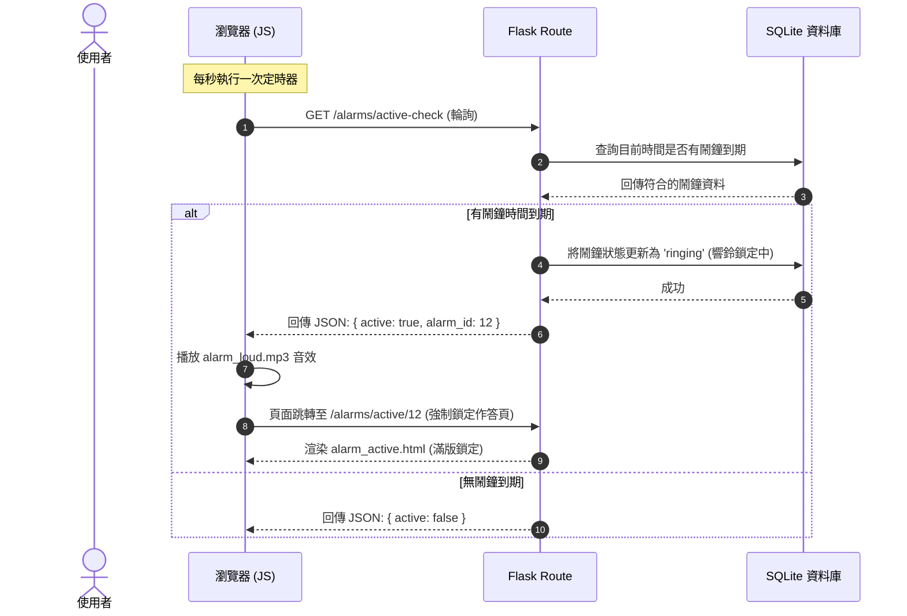
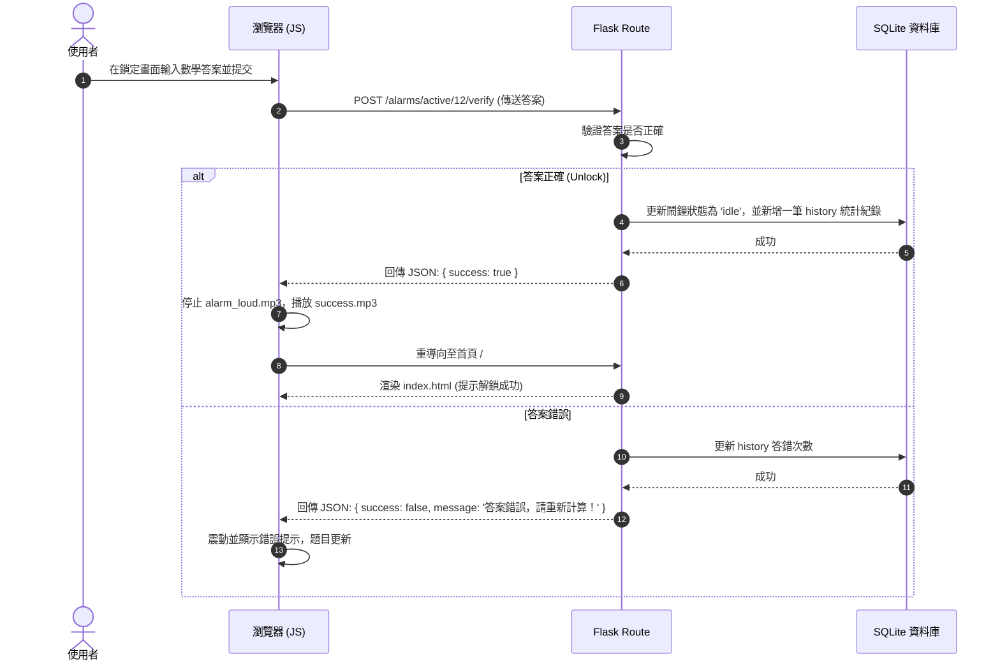

# 系統架構設計文件 (ARCHITECTURE) — MathAlarm

本文件詳細說明了「數學極致醒腦鬧鐘系統 (MathAlarm)」的系統架構、資料夾結構、元件交互關係與核心設計決策。

---

## 1. 技術架構說明

本系統採用經典的 **MVC (Model-View-Controller)** 架構模式，實作前後端合一的 Flask 網頁應用程式。

```
                    +--------------------------------+
                    |           瀏覽器 (Client)       |
                    +--------------------------------+
                               |            ^
                    (HTTP POST / GET)   (HTML / CSS / JS)
                               v            |
                    +--------------------------------+
                    |     Flask Route (Controller)   |
                    +--------------------------------+
                            /                  \
                    (呼叫 CRUD)             (渲染模板)
                          /                      \
                         v                        v
          +----------------------+      +----------------------+
          |     Model (Python)   |      |  Jinja2 Template (View)|
          +----------------------+      +----------------------+
                     |
                (SQL 讀寫)
                     v
          +----------------------+
          |   SQLite3 Database   |
          +----------------------+
```

### 1.1 技術選型 (Technology Stack)

本專案的技術選型以課堂統一規範為主，配合輕量、易於部署的工具，以降低學習門檻並提升開發效率：

| 層面 | 技術選擇 | 說明 |
| :--- | :--- | :--- |
| **前端** | HTML / CSS / JavaScript（純前端，無框架） | 課堂統一規範，確保基礎能力的建立。 |
| **後端** | Python + Flask | 課堂統一規範。Flask 作為輕量微框架，靈活且不具強加的約束，非常適合快速構建小型 Web 應用。 |
| **資料庫** | SQLite | 儲存使用者的鬧鐘設定與解題紀錄。SQLite 為無伺服器、單一檔案的輕量資料庫，不需額外安裝服務，與 Flask 高度契合，特別適合本專案的部署與教學演示。 |
| **模板引擎** | Jinja2（Flask 內建） | 後端直接渲染 HTML 頁面，簡化前後端分離的複雜度，大幅提升開發速度。 |
| **其他工具** | Git + GitHub | 版本控制與多人協作，程式碼推送至各自學號分支。 |

### 1.2 MVC 職責劃分
- **Model（模型）**：
  - 位於 `app/models/`。
  - 封裝所有 SQL 操作，負責與 SQLite 資料庫直接通訊。
  - 對 Controller 提供乾淨的 Python 介面（例如 `Alarm.get_all()`），隱藏底層 SQL 語法。
- **View（視圖）**：
  - 位於 `app/templates/` 與 `app/static/`。
  - Jinja2 模板（`.html` 檔案）定義頁面結構，並在後端填入動態資料。
  - CSS 負責磨砂玻璃等高級視覺設計；JavaScript 負責前端時間輪詢、數學答題互動與音效控制。
- **Controller（控制器/路由）**：
  - 位於 `app/routes/`。
  - Flask 路由函式負責接收 HTTP 請求，驗證表單輸入。
  - 調用 Model 進行資料庫變更，並根據執行結果決定重導向（Redirect）或渲染（Render）對應的 View。

---

## 2. 專案資料夾結構

本專案遵循高模組化與結構化的 Flask 推薦專案結構：

```
cxy_517-Advanced-Programming/
├── app/                        # 應用程式核心程式碼
│   ├── __init__.py             # Flask 應用程式工廠與初始化
│   ├── models/                 # 資料庫模型 (Model)
│   │   ├── __init__.py
│   │   ├── alarm.py            # 鬧鐘 CRUD 邏輯
│   │   └── history.py          # 起床作答歷史統計邏輯
│   ├── routes/                 # 路由與控制器 (Controller)
│   │   ├── __init__.py
│   │   ├── main.py             # 首頁與通用路由
│   │   ├── alarm.py            # 鬧鐘管理與狀態變更路由
│   │   └── dashboard.py        # 數據統計儀表板路由
│   ├── static/                 # 靜態資源 (View)
│   │   ├── css/
│   │   │   └── style.css       # 全域與 Glassmorphism 樣式
│   │   ├── js/
│   │   │   └── main.js         # 時間監聽、響鈴判斷、音效、答題控制
│   │   └── audio/
│   │       ├── alarm_loud.mp3  # 急促警報音效
│   │       └── success.mp3     # 答對解鎖音效
│   └── templates/              # Jinja2 HTML 模板 (View)
│       ├── base.html           # 基礎版面（載入 CSS、導覽列與 Flash 訊息）
│       ├── index.html          # 首頁（鬧鐘列表與新增表單）
│       ├── alarm_active.html   # 強制鎖定響鈴與作答畫面
│       └── dashboard.html      # 數據統計儀表板
├── database/                   # 資料庫相關初始化資源
│   └── schema.sql              # SQLite 建表 SQL 語法
├── docs/                       # 設計與規劃文件
│   ├── PRD.md
│   ├── ARCHITECTURE.md
│   ├── FLOWCHART.md
│   ├── DB_DESIGN.md
│   └── ROUTES.md
├── instance/                   # 執行實例目錄（由 Flask/SQLite 自動產生）
│   └── database.db             # SQLite 本端資料庫檔案
├── .env.example                # 環境變數範例
├── .gitignore                  # Git 忽略設定
├── app.py                      # 系統啟動入口點
├── README.md                   # 專案說明文件
└── requirements.txt            # Python 套件相依清單
```

---

## 3. 元件交互關係圖

### 3.1 瀏覽器輪詢與鬧鐘響起流程
下圖說明瀏覽器如何透過 JavaScript 定時輪詢，偵測鬧鐘時間並觸發鎖定作答：



### 3.2 數學計算解答與解鎖流程
下圖說明使用者作答並解鎖鬧鐘的流程：



---

## 4. 關鍵設計決策

為了確保系統的實用性、美觀度與防作弊能力，我們做出了以下關鍵架構與設計決策：

> [!NOTE]
> ### 決策一：Session 與資料庫雙重持久化（防逃避/防作弊）
> - **問題**：使用者在鬧鐘響起時，極易透過按「重新整理（F5）」或手動輸入首頁 URL 來跳過作答畫面。
> - **解法**：當鬧鐘被判定為「Ringing」時，系統會在後端資料庫與使用者的 Session 中同時寫入 `ringing_alarm_id`。我們實作了一個全域 Flask 攔截器（`before_request`）。只要偵測到當前有響鈴中的鬧鐘，且使用者嘗試瀏覽除「作答頁與驗證 API」以外的任何路由，系統將一律強制重導向（302 Redirect）回 `alarm_active.html`。這能徹底杜絕透過網頁刷新逃避作答的漏洞。

> [!TIP]
> ### 決策二：首頁使用者點擊互動授權（Autoplay 解決方案）
> - **問題**：現代瀏覽器出於體驗考量，禁止網頁在無使用者點擊互動前自動播放音訊。如果鬧鐘到期時瀏覽器默默響鈴卻沒有聲音，系統將完全失去喚醒作用。
> - **解法**：在首頁設計一個高質感的「啟動醒腦系統 / 授權音效監聽」磨砂玻璃開關。在使用者首次進入網站時，引導他們點擊該開關。點擊時，JavaScript 會解鎖並預載入音訊上下文（Audio Context）。這能確保後續鬧鐘響起時，音效能 100% 成功播放。

> [!IMPORTANT]
> ### 決策三：數學題目難度動態生成與驗證
> - **問題**：如果數學題是在前端 JavaScript 產生的，使用者可以輕易透過開啟瀏覽器開發者工具（F12）來查看變數或偽造關閉請求。
> - **解法**：數學題的生成與答案驗證 **完全在後端（Flask Controller）進行**。後端隨機產生題目字串（如 `"45 * 3 - 12"`）並在 Session 中儲存對應的正確答案。前端鎖定頁面只負責顯示題目字串並接收使用者輸入。這能防止任何透過 F12 檢視前端變數進行作弊的可能性。

> [!IMPORTANT]
> ### 決策四：UI 採用 Glassmorphism 深色磨砂玻璃主題
> - **問題**：剛起床時，白亮刺眼的網頁介面會導致嚴重的眼睛不適，使用戶產生排斥心理並直接關掉瀏覽器。
> - **解法**：採用精心微調的 **深色高對比主題 (Dark Palette)**，搭配 CSS 磨砂玻璃質感（Glassmorphism，利用 `backdrop-filter: blur()`）、漸層霓虹邊框與流暢的 CSS 微懸停動畫（Micro-animations）。這樣既能在視覺上給予醒腦的衝擊感，又具備高級數位產品的精緻度，大幅提升使用者體驗。
