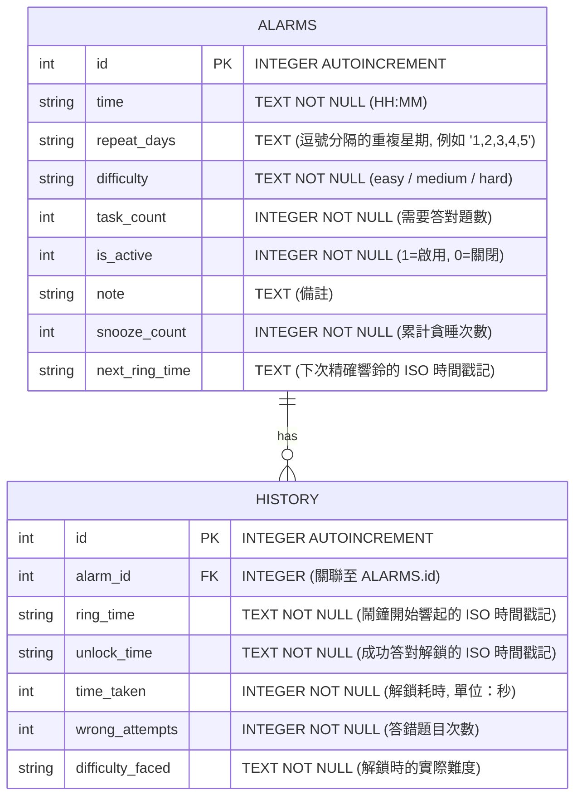

# 資料庫設計文件 (DB_DESIGN) — MathAlarm

本文件詳細規劃了「數學極致醒腦鬧鐘系統 (MathAlarm)」的 SQLite3 資料庫 Schema 設計、ERD 實體關係圖、建表語法以及 Python CRUD Models 的程式碼規範。

---

## 1. 實體關係圖 (ER 圖)

系統採用輕量而結構清晰的關聯式設計，包含兩個核心實體：`ALARMS` (鬧鐘主表) 與 `HISTORY` (起床歷史數據表)。一組鬧鐘可以產生多筆起床歷史紀錄（一對多關聯）。



---

## 2. 資料表詳細說明

### 2.1 `alarms` (鬧鐘資料表)
儲存使用者所設定的鬧鐘參數與狀態。

| 欄位名稱 | 資料型別 | 主鍵/外鍵 | 必填 | 預設值 | 說明 |
| :--- | :--- | :---: | :---: | :--- | :--- |
| `id` | `INTEGER` | PK | Yes | Auto-increment | 唯一識別 ID。 |
| `time` | `TEXT` | — | Yes | — | 鬧鐘響起時間，格式為 `HH:MM` (例如 `"07:30"`)。 |
| `repeat_days` | `TEXT` | — | No | `NULL` | 重複星期。逗號分隔的數字 `"1,2,3,4,5,6,0"`（1為週一，0為週日）。`NULL` 代表僅響鈴一次。 |
| `difficulty` | `TEXT` | — | Yes | `'easy'` | 計算難度：`'easy'`（加減）、`'medium'`（雙位數乘）、`'hard'`（連鎖混合）。 |
| `task_count` | `INTEGER` | — | Yes | `1` | 解鎖需要連續答對的數學題目數量。 |
| `is_active` | `INTEGER` | — | Yes | `1` | 是否啟用：`1` 代表開啟，`0` 代表關閉。 |
| `note` | `TEXT` | — | No | `NULL` | 鬧鐘的備註標籤或文字。 |
| `snooze_count` | `INTEGER` | — | Yes | `0` | 被連續按下貪睡的次數（用於計入貪睡懲罰計算）。 |
| `next_ring_time` | `TEXT` | — | No | `NULL` | 用於貪睡或單次鬧鐘的下次精確響鈴時間（ISO 8601 格式，如 `"2026-05-26T07:35:00"`）。 |

### 2.2 `history` (起床歷史數據統計表)
儲存每次鬧鐘觸發並成功完成數學作答的詳細歷史統計。

| 欄位名稱 | 資料型別 | 主鍵/外鍵 | 必填 | 預設值 | 說明 |
| :--- | :--- | :---: | :---: | :--- | :--- |
| `id` | `INTEGER` | PK | Yes | Auto-increment | 唯一識別 ID。 |
| `alarm_id` | `INTEGER` | FK (alarms.id) | No | `NULL` | 關聯的鬧鐘 ID。若關聯鬧鐘被刪除，此處設為 `SET NULL` 以保留統計數據。 |
| `ring_time` | `TEXT` | — | Yes | — | 鬧鐘開始響起的 ISO 8601 時間戳記。 |
| `unlock_time` | `TEXT` | — | Yes | — | 使用者正確解完所有題目解鎖的 ISO 8601 時間戳記。 |
| `time_taken` | `INTEGER` | — | Yes | — | 從響起到解鎖所耗費的總秒數。 |
| `wrong_attempts` | `INTEGER` | — | Yes | `0` | 答題錯誤的次數。 |
| `difficulty_faced` | `TEXT` | — | Yes | — | 解鎖時實際面臨的數學難度（可用於評估懲罰後難度）。 |

---

## 3. SQL 建表語法 (SQLite)

本專案的建表 SQL 指令儲存在 [database/schema.sql](file:///c:/Users/User/cxy_517-Advanced-Programming/database/schema.sql)。

```sql
-- 啟用外鍵約束
PRAGMA foreign_keys = ON;

-- 建立 alarms 表
CREATE TABLE IF NOT EXISTS alarms (
    id INTEGER PRIMARY KEY AUTOINCREMENT,
    time TEXT NOT NULL,
    repeat_days TEXT,
    difficulty TEXT NOT NULL DEFAULT 'easy',
    task_count INTEGER NOT NULL DEFAULT 1,
    is_active INTEGER NOT NULL DEFAULT 1,
    note TEXT,
    snooze_count INTEGER NOT NULL DEFAULT 0,
    next_ring_time TEXT
);

-- 建立 history 表
CREATE TABLE IF NOT EXISTS history (
    id INTEGER PRIMARY KEY AUTOINCREMENT,
    alarm_id INTEGER,
    ring_time TEXT NOT NULL,
    unlock_time TEXT NOT NULL,
    time_taken INTEGER NOT NULL,
    wrong_attempts INTEGER NOT NULL DEFAULT 0,
    difficulty_faced TEXT NOT NULL,
    FOREIGN KEY(alarm_id) REFERENCES alarms(id) ON DELETE SET NULL
);
```

---

## 4. Python Model 程式碼規範

Model 將使用原生 `sqlite3` 來操作 SQLite 資料庫，並配置 `row_factory = sqlite3.Row` 讓 Controller 可以直接用欄位名稱取值。

我們在 `app/models/` 資料夾下，為每個資料表規劃了專屬的 Python Class：
- `app/models/alarm.py`：封裝所有鬧鐘的資料庫 CRUD 與狀態更新函式。
- `app/models/history.py`：封裝歷史統計的寫入與圖表聚合分析邏輯。

各 Model 的介面設計細節如下所示：

### 4.1 Alarm Model (`app/models/alarm.py`)
- `get_db_connection()`：取得 SQLite 資料庫連線。
- `Alarm.create(data)`：新增一筆鬧鐘設定。
- `Alarm.get_all()`：取得資料庫中所有的鬧鐘設定，按時間升序排列。
- `Alarm.get_by_id(id)`：根據 ID 獲取單筆鬧鐘詳情。
- `Alarm.update(id, data)`：更新鬧鐘設定。
- `Alarm.delete(id)`：刪除鬧鐘設定。
- `Alarm.toggle_status(id)`：快速開啟或關閉鬧鐘。
- `Alarm.update_snooze(id, count, next_ring)`：更新鬧鐘的貪睡狀態與下次響鈴時間。

### 4.2 History Model (`app/models/history.py`)
- `History.create(alarm_id, ring_time, unlock_time, time_taken, wrong_attempts, difficulty_faced)`：新增一筆起床歷史數據。
- `History.get_all()`：取得所有歷史紀錄。
- `History.get_stats()`：聚合統計起床數據（如平均解鎖秒數、總答錯次數、連續不遲到天數等），供儀表板圖表渲染。
