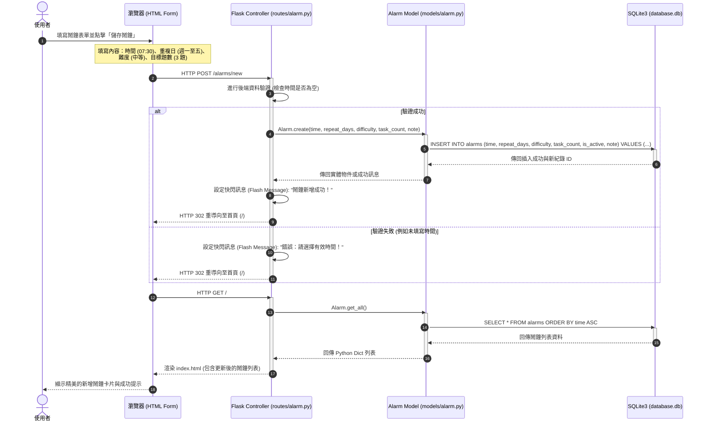

# 流程圖與功能對照文件 (FLOWCHART) — MathAlarm

本文件以 Mermaid 流程圖語法視覺化呈現「數學極致醒腦鬧鐘系統 (MathAlarm)」的使用者操作路徑（User Flow）、系統序列圖（Sequence Diagram）以及詳細的功能清單對照表。

---

## 1. 使用者流程圖 (User Flow)

下圖描述使用者進入網站、設定鬧鐘、觸發響鈴鎖定、進行數學作答與查看數據統計的完整操作路徑：

```mermaid
flowchart TD
  %% 節點定義與樣式
  Start([使用者開啟網頁]) --> Home{首頁狀況?}
  
  %% 首頁判定分支
  Home -->|狀態 A: 當前無響鈴鬧鐘| NormalFlow[首頁儀表板 - 鬧鐘列表]
  Home -->|狀態 B: 當前有響鈴鬧鐘| DirectLock[強制重新導向 - 全螢幕鎖定作答]

  %% 正常流操作
  subgraph 正常管理流 (Normal Flow)
    NormalFlow --> AuthSound[點擊「啟用音效授權」開關]
    NormalFlow --> AlarmCRUD{執行什麼操作?}
    
    %% CRUD 分支
    AlarmCRUD -->|新增鬧鐘| AddForm[填寫鬧鐘表單: 時間/重複日/難度/題數] --> AddSubmit[送出表單] --> NormalFlow
    AlarmCRUD -->|切換開關| ToggleSwitch[開啟/關閉鬧鐘] --> ToggleSubmit[AJAX 更新狀態] --> NormalFlow
    AlarmCRUD -->|刪除鬧鐘| DeleteAction[點擊刪除按鈕] --> DeleteSubmit[POST 刪除並重導向] --> NormalFlow
    AlarmCRUD -->|查看歷史| ViewStats[點擊「數據統計」導覽] --> LoadCharts[進入統計頁: 載入起床數據圖表]
  end

  %% 輪詢與響鈴流
  subgraph 響鈴鎖定與解鎖流 (Ringing & Active Flow)
    BackgroundCheck[背景 JS 每秒輪詢 check] -->|時間到且狀態為啟動| RingTrigger([觸發鬧鐘響起])
    RingTrigger --> PlayAudio[播放警報 mp3 & 頁面跳轉]
    PlayAudio --> LockScreen[全螢幕鎖定畫面: 顯示隨機數學題]
    
    DirectLock --> LockScreen

    LockScreen --> UserAction{使用者選擇?}
    
    %% 作答分支
    UserAction -->|輸入解答並提交| SubmitAnswer[後端比對答案]
    SubmitAnswer --> AnswerCheck{答案是否正確?}
    
    AnswerCheck -->|是| CorrectAdd[答對數 +1] --> WinCheck{答對數是否達到設定目標?}
    WinCheck -->|未達到| NextQ[產生新題目] --> LockScreen
    WinCheck -->|已達到| StopAudio[停止警報聲 & 播放成功提示音] --> SaveRecord[寫入 SQLite 起床歷史紀錄] --> UnlockRedirect[解除鎖定並導回首頁] --> NormalFlow

    AnswerCheck -->|否| WrongAction[答錯次數 +1 & 畫面震動] --> NextQ

    %% 貪睡分支
    UserAction -->|點擊貪睡 Snooze| SnoozeAction[寫入貪睡狀態與懲罰機制] --> SnoozeAudio[暫停響鈴 5 分鐘] --> SnoozeRedirect[重導向回首頁] --> NormalFlow
  end

  %% 樣式設定
  style Start fill:#4F46E5,stroke:#312E81,stroke-width:2px,color:#fff
  style RingTrigger fill:#DC2626,stroke:#7F1D1D,stroke-width:2px,color:#fff
  style LockScreen fill:#7C3AED,stroke:#4C1D95,stroke-width:2px,color:#fff
  style UnlockRedirect fill:#10B981,stroke:#065F46,stroke-width:2px,color:#fff
```

---

## 2. 系統序列圖 (Sequence Diagram)

本序列圖詳細描述**「使用者點擊新增鬧鐘」**到**「資料庫寫入成功並重新渲染首頁」**的完整系統互動流程：



---

## 3. 功能清單與路由對照表

以下為本系統的所有 HTTP 路由功能、對應的 URL 路徑、方法、對應視圖模板及用途說明：

| 功能模組 | 功能名稱 | HTTP 方法 | URL 路徑 | 對應 Jinja2 模板 | 說明 |
| :--- | :--- | :--- | :--- | :--- | :--- |
| **首頁與通用** | 首頁與鬧鐘列表 | `GET` | `/` | `index.html` | 展示鬧鐘列表、新增鬧鐘表單及音效授權開關。 |
| **鬧鐘管理** | 新增鬧鐘 | `POST` | `/alarms/new` | — (重導向 `/`) | 接收表單資料，呼叫 Model 寫入 SQLite。 |
| | 切換開關狀態 | `POST` | `/alarms/<int:id>/toggle` | — (AJAX JSON) | 切換鬧鐘啟用/停用狀態，更新資料庫，回傳 JSON。 |
| | 刪除鬧鐘 | `POST` | `/alarms/<int:id>/delete` | — (重導向 `/`) | 接收鬧鐘 ID，從資料庫中刪除，完成後重導向。 |
| **警報與鎖定** | 鬧鐘到期輪詢 | `GET` | `/alarms/active-check` | — (AJAX JSON) | 由前端 JS 每秒輪詢，檢查目前時間是否有鬧鐘到期。 |
| | 全螢幕鎖定畫面 | `GET` | `/alarms/active/<int:id>` | `alarm_active.html` | 強制全螢幕響鈴畫面，顯示數學題目，封鎖其他網頁操作。 |
| | 數學解答驗證 | `POST` | `/alarms/active/<int:id>/verify` | — (AJAX JSON) | 接收使用者輸入的答案，在後端進行比對。答對回傳成功。 |
| | 貪睡設定 | `POST` | `/alarms/active/<int:id>/snooze` | — (AJAX JSON) | 暫停當前鬧鐘，設定 5 分鐘後再次響起，並加上難度懲罰。 |
| **數據統計** | 起床歷史統計 | `GET` | `/dashboard` | `dashboard.html` | 讀取起床歷史資料庫，呈現答題時間與答錯率的視覺化圖表。 |
