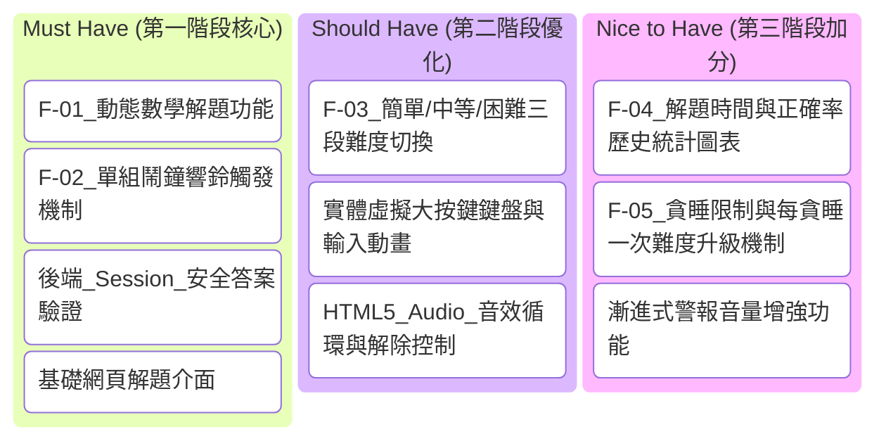

# MathWake 智力喚醒鬧鐘 — 產品需求文件 (PRD)

本文件詳細規劃「MathWake 智力喚醒鬧鐘」的產品需求，並針對 **F-01 動態數學解題功能** 進行深入的技術架構與邏輯設計，旨在提供開發團隊一套清晰、嚴謹且易於實作的規格指南。

---

## 1. 專案概述

### 1.1 背景與動機
現代人普遍面臨賴床、無意識關閉鬧鐘後繼續陷入睡眠（Snooze loop）的問題。傳統鬧鐘的關閉難度極低，用戶只需輕輕一滑或按壓按鈕即可關閉，此時大腦尚未完全醒轉。  
**MathWake 智力喚醒鬧鐘** 透過在鬧鐘響起時強制用戶進行「數學解題挑戰」來解決此痛點。藉由即時、動態且不可輕易跳過的數學運算，刺激用戶的前額葉皮質（Prefrontal Cortex），強制活化大腦思考，從而達到快速且清醒起床的目的。

### 1.2 目標用戶
- **重度賴床者**：有多次貪睡習慣、經常無意識關閉鬧鐘而遲到的人群。
- **晨型人培育者**：希望在早晨第一時間讓大腦開機、進入高效工作/學習狀態的學生與上班族。
- **科技與自我管理者**：喜愛透過數字與統計管理生活作息的效率達人。

### 1.3 核心價值主張
- **物理與心智雙重喚醒**：聲音與智力挑戰雙管齊下，不解開題目，鬧鐘絕不罷休。
- **無縫互動體驗**：專為半夢半醒狀態設計的超大觸控按鍵與防呆介面。
- **安全防弊機制**：核心解題邏輯與答案驗證完全在後端運行，防止用戶透過前端重新整理或修改網頁原始碼繞過挑戰。

---

## 2. 功能需求

以下為 MathWake 的五大核心功能模組與其對應的使用者故事：

### F-01: 動態數學解題 (核心功能)
- **使用者故事**：作為一名「重度賴床者」，我希望在鬧鐘響起時，螢幕會鎖定並隨機生成一組四則運算題目，以便我必須集中精神解出正確答案才能關閉鬧鐘，防止我無意識地關閉鬧鐘。
- **主要規格**：
  - 支援「加、減、乘、除」四則運算。
  - 題目必須在後端動態生成，嚴格禁止前端產生或儲存解答。
  - 除法運算必須保證能夠整除，避免出現無限小數。

### F-02: 鬧鐘設定與多組管理
- **使用者故事**：作為一名「上班族」，我希望能夠設定多組不同時間的鬧鐘，並能自由啟用、停用、新增或刪除，以便適應工作日與週末不同的作息安排。
- **主要規格**：
  - 支援設定時間（時、分）、重複週期（每週一至週五、週末等）。
  - 可為每組鬧鐘獨立指定解題難度（簡單、中等、困難）。

### F-03: 難度與題型自訂
- **使用者故事**：作為一名「數學不擅長但想強迫起床的用戶」，我希望可以自由調整鬧鐘的解題難度與運算子類型，以便我能以適合自己的心智負擔逐漸建立起床習慣。
- **主要規格**：
  - **簡單 (Easy)**：2 個個位數/雙位數的加減法（如 `12 + 7`）。
  - **中等 (Medium)**：3 個數值（雙位數）的混合加減乘（如 `25 - 4 * 3`）。
  - **困難 (Hard)**：3-4 個數值的混合加減乘除，包含括號（如 `(48 / 6) * 12 - 15`），且答案保證為整數。

### F-04: 歷史紀錄與喚醒統計
- **使用者故事**：作為一名「自我管理者」，我希望在解題成功後，系統能記錄我花費的解題秒數與正確率，並以圖表呈現，以便我追蹤自己大腦每日清醒的速度與進步趨勢。
- **主要規格**：
  - 記錄每次鬧鐘響起時間、實際解題完成時間、嘗試次數。
  - 計算平均「喚醒秒數」。

### F-05: 智能貪睡 (Snooze) 限制與懲罰機制
- **使用者故事**：作為一名「極度想賴床的用戶」，我希望在實在無法立即解題時能有短暫的貪睡喘息機會，但系統必須限制貪睡次數，且每次貪睡後題目難度應逐漸增加，以便防止我無限期賴床。
- **主要規格**：
  - 每次鬧鐘最多允許貪睡 2 次。
  - 貪睡間隔隨次數遞減（例如：第一次 5 分鐘，第二次 3 分鐘）。
  - 每貪睡一次，下一次響鈴的題目難度自動提升一階（例如：簡單 $\rightarrow$ 中等）。

---

## 3. 非功能需求

### 3.1 技術限制與架構
- **後端技術**：使用 Python (Flask) 作為 Web 服務框架，搭配 SQLite 作為輕量化關聯式資料庫。
- **前端技術**：採用 HTML5、Vanilla CSS（純 CSS，無 Tailwind）與 Vanilla JavaScript 進行 DOM 操縱與互動。
- **頁面渲染**：使用 Flask 內建的 Jinja2 模板引擎進行動態頁面渲染。

### 3.2 效能與響應考量
- **超低延遲**：鬧鐘觸發與解題提交的 API 反應時間必須小於 200ms，確保流暢度。
- **輕量化資源**：前端解題介面需保持極簡，確保在移動端或低效能裝置上亦能秒開。

### 3.3 安全性與防作弊
- **後端狀態保持**：每次生成題目時，後端將題目文本與唯一解（答案）加密或寫入資料庫/Session，前端只接收題目文本與一個隨機生成的挑戰 ID（Challenge ID）。
- **答案防窺**：禁止在網頁原始碼、Cookie 或 LocalStorage 中洩漏答案。
- **關閉防禦**：前端介面採用全螢幕遮罩，攔截常用鍵盤快捷鍵（如 Escape、Space），並在響鈴時循環播放音訊，防止用戶直接無視介面。

---

## 4. F-01 動態數學解題功能規劃

本章節為 F-01 功能的詳細核心設計，包含後端算法、API 路由與前端互動規格。

### 4.1 後端 Python (Flask) 隨機題目生成算法邏輯

為確保題目具有挑戰性且答案皆為整數，算法需根據難度採取不同的生成策略：

#### A. 算法規則設計
1. **加減法 (Addition/Subtraction)**：
   - 簡單難度下，數值介於 `1 ~ 30`。
   - 減法運算時，若為簡單難度，應確保被減數大於減數，避免出現負數導致用戶清晨挫折感過重。
2. **乘法 (Multiplication)**：
   - 簡單難度不包含乘法。
   - 中等難度包含單個乘法，乘數介於 `2 ~ 9`，被乘數 `2 ~ 15`。
3. **除法 (Division) — 整除保證算法**：
   - **核心邏輯**：要生成 $A \div B = C$ 且 $C$ 為整數，算法應**先隨機生成除數 $B$ 與商 $C$，再計算出被除數 $A = B \times C$**。最後將題目呈現為 $A \div B$。
   - 如此可 $100\%$ 保證整除，且運算難度完全可控。

#### B. 題目生成器程式碼邏輯實作預想
後端將設計一個 `MathProblemGenerator` 類別：

```python
import random

class MathProblemGenerator:
    @staticmethod
    def generate(difficulty="easy"):
        """
        根據難度生成題目與答案
        回傳格式: (formula_string, integer_answer)
        """
        if difficulty == "easy":
            # 簡單：2 個數字的加減法 (1~20)
            a = random.randint(5, 20)
            b = random.randint(1, a)  # 確保相減為正數
            operator = random.choice(["+", "-"])
            
            if operator == "+":
                return f"{a} + {b}", a + b
            else:
                return f"{a} - {b}", a - b

        elif difficulty == "medium":
            # 中等：3 個數字的加減乘混合運算
            # 範例結構：a + b * c 或 a * b - c
            a = random.randint(10, 50)
            b = random.randint(2, 9)
            c = random.randint(2, 9)
            
            op1, op2 = random.choice([("+", "*"), ("-", "*"), ("*", "+"), ("*", "-")])
            
            if op1 == "*":
                formula = f"{a} * {b} {op2} {c}"
                ans = eval(formula)
            else:
                formula = f"{a} {op1} {b} * {c}"
                ans = eval(formula)
                
            return formula.replace("*", "×"), int(ans)

        elif difficulty == "hard":
            # 困難：3-4 個數，包含加減乘除與括號
            # 為了保證除法整除，我們先構建一個整除對
            b_div = random.randint(2, 12)  # 除數
            c_div = random.randint(2, 12)  # 商
            a_div = b_div * c_div          # 被除數 (a_div / b_div = c_div)
            
            # 再加上一個加減或乘法項
            d = random.randint(15, 100)
            operator = random.choice(["+", "-", "*"])
            
            if operator == "+":
                # 形如: (A / B) + D
                formula = f"({a_div} / {b_div}) + {d}"
                ans = c_div + d
            elif operator == "-":
                # 形如: D - (A / B)
                formula = f"{d} - ({a_div} / {b_div})"
                ans = d - c_div
            else:
                # 形如: (A / B) * D，限制 D 較小以免數值爆大
                d_small = random.randint(2, 6)
                formula = f"({a_div} / {b_div}) * {d_small}"
                ans = c_div * d_small
                
            # 將除號與乘號轉換為網頁友好顯示字元
            display_formula = formula.replace("/", "÷").replace("*", "×")
            return display_formula, int(ans)
```

---

### 4.2 API 路由設計

為確保前後端邏輯對齊，API 設計需具備高度安全性。所有運算皆在後端驗證，並透過 Session 機制綁定當前挑戰。

| API 端點 | HTTP 方法 | 說明 | 請求參數 (JSON) | 回傳參數 (JSON) |
| :--- | :--- | :--- | :--- | :--- |
| `/api/alarms/active-challenge` | `GET` | 獲取當前響鈴中鬧鐘的解題挑戰題目 | 無 | `{"challenge_id": "uuid...", "formula": "12 × 4 - 8"}` |
| `/api/alarms/verify` | `POST` | 驗證使用者輸入的數學答案 | `{"challenge_id": "uuid...", "answer": 40}` | `{"success": true, "message": "解題成功，鬧鐘關閉"}` 或 `{"success": false, "message": "解答錯誤，請重試！"}` |
| `/api/alarms/snooze` | `POST` | 申請鬧鐘進入貪睡模式 | `{"challenge_id": "uuid..."}` | `{"success": true, "snooze_count": 1, "next_ring": "07:15"}` 或 `{"success": false, "message": "已達貪睡上限，必須解題！"}` |

#### 驗證流程圖 (邏輯流)
1. 鬧鐘觸發 $\rightarrow$ 瀏覽器跳轉至解題頁面 `/alarm/ring`。
2. 頁面載入時，前端發送請求至 `GET /api/alarms/active-challenge`。
3. 後端隨機生成題目，將其 `(formula, answer)` 與產生的 `challenge_id` 寫入後端 Session，並將 `challenge_id` 與 `formula` 回傳前端。
4. 使用者在前端解題介面輸入答案，按下送出 $\rightarrow$ `POST /api/alarms/verify`。
5. 後端從 Session 中比對該 `challenge_id` 的正確答案：
   - **正確**：清除 Session 挑戰狀態、停止鬧鐘響鈴狀態，回傳 `{"success": true}`。
   - **錯誤**：增加嘗試次數，回傳 `{"success": false}`，前端觸發錯誤動畫並清空輸入框。

---

### 4.3 前端 HTML/CSS 解題互動介面需求

前端頁面是直接喚醒大腦的視覺載體，必須滿足以下「強互動、極簡、高對比」的設計要求：

#### A. 介面佈局與視覺美學 (UI/UX)
- **色彩計畫**：
  - 採用高品質暗黑模式（Sleek Dark Mode），背景以深邃的灰黑藍（如 `#0d0f12`）為主，搭配霓虹漸層（如藍紫色 `#6366f1` 到 `#a855f7`）作為主題點綴色。
  - 當警報響起時，頂部或背景可呈現微妙的紅色呼吸燈光影效果（Pulse Animation），加強緊迫感。
- **字型與排版**：
  - 導入 Google Fonts (例如 `Outfit` 或 `Plus Jakarta Sans`)，提供極具未來感的無襯線字體。
  - 數學算式必須以極大的字級（如 `3rem` 以上）顯示於畫面正中央，字體加粗，具備微發光效果。
- **解題互動鍵盤 (Virtual Keypad)**：
  - 半夢半醒下手指無法精準敲擊小鍵盤，因此頁面必須提供一組**大型網格虛擬按鍵**（數字 0-9、退格鍵 Backspace、清除鍵 Clear、確認鍵 Enter）。
  - 虛擬按鍵需有明顯的懸停（Hover）與點擊（Active）動態縮放與陰影變化。

#### B. 互動邏輯與 JS 行為
- **自動聚焦與音訊鎖定**：
  - 進入頁面後，立即以對話框提示或點擊事件「解鎖」瀏覽器音訊播放限制，隨即循環播放極具喚醒效果的電子鬧鈴聲。
  - 直到 `/verify` 回傳 `success: true`，音訊方可暫停播放，且頁面展示「早安！大腦已成功喚醒」的漸變動畫，隨後導回首頁。
- **防作弊與干擾限制**：
  - 使用 JS 攔截 `beforeunload` 事件，若用戶試圖關閉或重新整理網頁，提示「鬧鐘仍在運行，請完成解題！」
  - 監聽 `keydown` 事件，阻止 `Escape` 鍵的預設動作。
- **錯誤視覺回饋**：
  - 當提交錯誤答案時，算式顯示區域觸發**左右劇烈搖晃動畫（Shake Animation）**，且輸入框與外框閃爍紅色光暈，並提供短促的低頻錯誤音效。

---

## 5. MVP 範圍規劃

為確保專案能穩健推進，我們將功能劃分為三個優先級層次：



---

## 6. 專案成員與分工

本專案由開發團隊協同合作，具體分工如下表所示（團隊成員可於後續對齊會議中填寫）：

| 角色 / 職責 | 負責人 | 預估時數 | 交付產出物 | 備註 |
| :--- | :--- | :--- | :--- | :--- |
| **產品經理 (PM)** | 待指派 | | 產品需求文件 (PRD)、功能驗收規格 | |
| **後端工程師 (Backend)** | 待指派 | | Flask 路由、動態數學生成演算法、Session 驗證 API | |
| **前端工程師 (Frontend)** | 待指派 | | HTML 解題挑戰頁面、虛擬鍵盤、CSS 搖晃動畫與音訊解鎖邏輯 | |
| **測試工程師 (QA)** | 待指派 | | 功能測試案例、防作弊繞過測試報告 | |

---

*文件版本：v1.0 | 規劃日期：2026-06-02*
