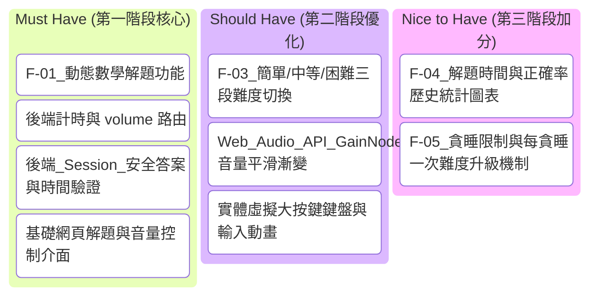

# 產品需求文件 (PRD) — 數學極致醒腦鬧鐘系統 (MathAlarm)

本文件定義了「數學極致醒腦鬧鐘系統 (MathAlarm)」的產品功能、使用者故事、非功能需求與 MVP 開發範疇，旨在提供開發團隊清晰的實作指引。
# MathWake 智力喚醒鬧鐘 — 產品需求文件 (PRD)

本文件詳細規劃「MathWake 智力喚醒鬧鐘」的產品需求，並針對 **F-01 動態數學解題功能** 進行深入的技術架構與邏輯設計，旨在提供開發團隊一套清晰、嚴謹且易於實作的規格指南。

---

## 1. 專案概述

### 1.1 背景與動機
現代人在早晨起床時普遍面臨「睡眠慣性（Sleep Inertia）」的問題。剛起床的數分鐘內，大腦的決策區塊活躍度極低，使人處於半夢半醒的朦朧狀態。
傳統鬧鐘（包含手機內建鬧鐘）通常只需簡單的滑動或按下實體按鍵即可輕易關閉。這導致許多使用者在無意識下關閉鬧鐘，或反覆按下「貪睡（Snooze）」按鍵，最終再次入睡，造成慣性遲到，嚴重影響早晨的學習與工作效率。

### 1.2 目標使用者
本系統完成後，旨在解決以下三大核心目標用戶的清醒與起床痛點：
- **大學生**：需應付早八課程、容易熬夜且難以起床，極度需要強效的外力喚醒。
- **備考考生**：需要建立嚴謹的晨間儀式感，藉由快速的數學運算題提早讓大腦進入高效率的思考與學習狀態。
- **重度賴床者**：一般鬧鐘聲響已對其失效，必須透過心算邏輯運算強制解除睡眠慣性。

### 1.3 專題目標
系統完成後，將著重解決以下三大核心清醒與起床障礙：
- **目標一：強制開機**：透過必須進行的數學運算邏輯思考機制，迅速刺激大腦皮質，有效消除剛起床時的「睡眠慣性」。
- **目標二：杜絕賴床**：建立不可輕易跳過、防重新整理、防按鈕繞過的「強制解鈴鎖定機制」，阻斷使用者在半夢半醒間的盲目關閉行為。
- **目標三：清醒管理**：藉由「貪睡懲罰（難度/數量升級）」與「起床效率大數據歷史紀錄」，以數據化指標激勵使用者立刻採取行動，養成健康的生活作息。

### 1.4 核心價值主張
透過「強制數學運算」與「系統防避鎖定」的雙重刺激：
1. **心智刺激**：強迫大腦在關閉鬧鐘時進行邏輯運算，迅速喚醒決策區，打破睡眠慣性。
2. **物理鎖定**：限制網頁的一般操作與重新整理，防止使用者以簡單的刷新手段規避鬧鐘。
確保使用者在順利關閉鬧鐘時，大腦已處於完全清醒狀態，徹底解決慣性遲到痛點。

## 2. 需求分析與功能規劃

### 2.1 功能性需求 (Functional Requirements)
本系統的核心功能編號、名稱與描述定義如下，代表系統「必須能做到」的核心能力：

| 功能編號 | 功能名稱 | 功能描述 |
| :--- | :--- | :--- |
| **F-01** | 動態與隨機解題 | 鬧鐘響起時由後端隨機產生或抽選對應難度的數學題，使用者必須正確輸入解答後方可關閉鬧鐘，刺激大腦開機。 |
| **F-02** | 階梯音量懲罰 | 若超過設定時間未解出題目，系統將自動調高播放頻率與警報音量，給予強烈的急迫感。 |
| **F-03** | 防逃避遮罩機制 | 鬧鐘響鈴期間，系統強制啟用滿版遮罩畫面，阻斷快捷鍵與一般切換，限制使用者進行作弊或逃避。 |
| **F-04** | 歷史紀錄清單 | 系統記錄使用者每次成功解題關閉鬧鐘的時間、日期與所花費的秒數，並在前端以 HTML 表格 (Table) 呈現。 |
| **F-05** | 難度手動分級 | 允許使用者在設定鬧鐘時選擇難度：簡單（低位數加減）、中等（乘除綜合）、困難（微積分與統計基礎概念之預設題庫抽選）。 |
| **F-06** | 隨機早安語錄 | 成功解鎖後，系統跳轉至早安面板，並透過後端 random 模組隨機抽選一句早安評語或鼓勵語錄給使用者。 |
| **F-07** | 快速反應力測試 | 數學題解完後，強制玩家進行一個簡單的 JS 隨機點擊紅色移動小球遊戲，作為雙重清醒驗證，確保大腦未重回睡眠。 |
| **F-08** | 緊急求救罰寫解鎖 | 考量解題卡關痛點，提供緊急按鈕，必須在輸入框手寫罰寫預設警示句 10 次方可解鎖，並在歷史紀錄上記為「SOS 關閉」。 |
| **F-09** | 鬧鐘情境預設模式 | 鬧鐘設定頁面提供「考試地獄（強迫困難且停用貪睡）」、「平日上課（中等）」與「週末溫和」的一鍵套用情境模組。 |
| **F-10** | 隨機本機音效庫 | 存放多組不同警報、搖滾、惡搞音效，響鈴時由後端或前端隨機抽選播放，防止耳朵對單一鈴聲產生適應性。 |

---

### 2.2 核心功能模組與使用者故事
系統包含以下五大核心功能模組與其對應的使用者故事：

#### 2.2.1 鬧鐘設定與管理模組
* **功能描述**：使用者能自由設定多組鬧鐘的時間、啟用狀態、重複星期與備註。
* **使用者故事**：
  > 作為 **重度睡眠者**，我希望 **能自由新增、編輯、開啟/關閉及刪除鬧鐘，並設定重複星期與備註**，以便 **能配合我不同日期的作息時間與行程**。

#### 2.2.2 數學計算鎖定模組
* **功能描述**：鬧鐘響起時，螢幕將切換至全螢幕鎖定畫面，播放急促的音效，使用者必須在限時內解出隨機生成的數學題目才能停止鬧鐘。
* **使用者故事**：
  > 作為 **醒腦困難的用戶**，我希望 **在鬧鐘響起時，螢幕被強制滿版鎖定，必須正確解答隨機產生的數學計算題**，以便 **強迫我動腦運算，防止我在半夢半醒間無意識關閉鬧鐘**。

#### 2.2.3 難度級別設定模組
* **功能描述**：支援三級數學難度分級系統，並可自訂需要答對的題目數量：
  | 難度級別 | 題型範疇 | 題型範例與來源 |
  | :--- | :--- | :--- |
  | **簡單** | 低位數加減法 | `7 + 5 = ?`、`13 - 8 = ?`（後端亂數動態生成） |
  | **中等** | 兩位數與乘除綜合運算 | `14 × 6 = ?`、`96 ÷ 8 = ?`（後端亂數動態生成） |
  | **困難** | 基礎微積分與統計學彩蛋題 | 簡單微分 `d/dx (3x²) = ?`、基本定積分 `∫₀¹ 2x dx = ?`、信賴區間 $Z$ 值或 $t$ 分配自由度概念（由後端預設題庫陣列隨機抽選） |
* **使用者故事**：
  > 作為 **大學生或備考考生**，我希望 **能為不同鬧鐘設定簡單、中等或困難的運算難度，並指定需要答對的題數**，以便 **根據我的清醒難度或特定日程的緊急程度，選擇最適合的醒腦關卡強度**。

#### 2.2.4 貪睡與懲罰機制模組
* **功能描述**：允許暫時按下貪睡按鈕，但每次按下貪睡，下次響起時的數學題目難度會自動提升或題目數量加倍。
* **使用者故事**：
  > 作為 **習慣賴床的用戶**，我希望 **當我按下貪睡按鈕時，下一次鬧鐘響起會伴隨更難的數學題或更多的題數**，以便 **產生懲罰阻力，打消我反覆賴床的念頭**。

#### 2.2.5 歷史紀錄清單模組
* **功能描述**：系統自動記錄每次響鈴設定時間、實際成功關閉的時間、以及答題花費的秒數，並在前端以純 HTML Table 清單呈現，方便使用者檢視。
* **使用者故事**：
  > 作為 **希望養成自律習慣的用戶**，我希望 **有一個歷史紀錄頁面能看到我每天的設定時間、起床時間與花費秒數**，以便 **能量化追蹤我的早起習慣改善成效**。

#### 2.2.6 隨機早安語錄與儀式模組
* **功能描述**：關閉鬧鐘後，介面會顯示專屬早安面板，並透過 Python 的 `random` 模組從預設的語錄清單（List）中隨機抽取並展示一句早安激勵（或幽默嘲諷）語錄。
* **使用者故事**：
  > 作為 **需要早起動力的大學生**，我希望 **在成功解開數學題後，能看到溫馨或有趣的隨機早安語錄與當日提醒**，以便 **在清醒的第一時間獲得正向的心態回饋**。

#### 2.2.7 快速反應力雙重驗證模組
* **功能描述**：在數學題正確回答後，鎖定畫面不會立刻關閉，而是跳出一個滿版畫布，隨機生成一個快速移動的紅點，使用者必須在限時 5 秒內用滑鼠或手指成功點擊 5 次，驗證大腦手眼協調度。
* **使用者故事**：
  > 作為 **解題後容易秒睡的重度賴床者**，我希望 **在答對數學題後，強制進行紅點點擊的快速反應遊戲**，以便 **刺激運動神經，確保我的大腦已經完全脫離昏睡狀態**。

#### 2.2.8 緊急求救罰寫解鎖模組
* **功能描述**：當使用者真的無法解答數學題時，可點擊「緊急求救」按鈕。此時畫面會顯示一段隨機長句（如「我保證今晚一定在 11 點前睡覺，絕不賴床」），使用者必須手動在輸入框罰寫並核對完全相同 10 次，才能靜音鬧鐘。
* **使用者故事**：
  > 作為 **可能遇到極限卡關的用戶**，我希望 **在真的解不出高等微積分題目時，有罰寫句子的緊急求救關鈴手段**，以便 **在不會被鬧鐘持續疲勞轟炸的同時，依然能被迫動手罰寫而達到清醒效果**。

#### 2.2.9 預設情境模式模組
* **功能描述**：在設定鬧鐘時，使用者能下拉選擇快速套用情境：
  * **「考試地獄」**：自動設定為困難模式、5 題、禁起用貪睡、音量懲罰間隔縮短。
  * **「平日上課」**：自動設定為中等難度、2 題、可貪睡 1 次。
  * **「週末溫和」**：自動設定為簡單難度、1 題、可無限貪睡。
* **使用者故事**：
  > 作為 **作息多樣的大學生**，我希望 **能一鍵套用考試地獄或週末溫和的情境預設**，以便 **省去手動逐項調整難度和貪睡規則的繁瑣步驟**。

#### 2.2.10 隨機響鈴音效庫模組
* **功能描述**：後端存放多個 `.mp3` 鬧鈴檔案（如復古警鈴、吵鬧金屬樂、搞笑尖叫等），每次鬧鐘觸發時，由程式隨機抽選一首播放，保持聽覺的新鮮感與急迫感。
* **使用者故事**：
  > 作為 **對單一鬧鈴聲容易免疫的用戶**，我希望 **每天早上響鈴的聲音都是隨機不同的吵鬧音效**，以便 **防止我的大腦對相同頻率的聲音自動過濾而繼續沉睡**。

---

## 3. 非功能需求 (Non-functional Requirements)

本系統的非功能性品質要求與技術限制定義如下：

### 3.1 系統品質要求 (Quality Requirements)

| 品質類別 | 需求描述 |
| :--- | :--- |
| **效能** | 鬧鐘觸發與判定需達到毫秒級精準度。 |
| **易用性** | 介面設計需大字體與高對比，確保在視線模糊與大腦渾沌時仍能直覺操作與作答。 |
| **安全性** | 系統僅請求/使用必要的全螢幕覆蓋機制以實現防逃避防作弊，確保絕不蒐集或外洩使用者的個人與隱私資料。 |
| **離線可用性** | 核心的鬧鐘排程判定、本地端響鈴與題庫隨機抽選生成，必須能完全在本地伺服器（Localhost）離線運行，不依賴任何外部 API 或網路連線。 |
| **響應式設計 (RWD)** | 前端所有頁面（特別是 F-03 全螢幕鎖定遮罩）必須支援響應式排版，確保在電腦、平板與手機瀏覽器上皆能正確呈現且不跑版，防止遮罩被繞過。 |

---

### 3.2 技術限制
- **後端架構**：使用 `Python` + `Flask` 微框架。
- **前端渲染**：使用 `Jinja2` 模板引擎，配合 HTML5、Vanilla CSS (Bootstrap 5 輔助) 與 Vanilla Javascript，不採用前後端分離。
- **資料庫**：使用輕量級的 `SQLite` 資料庫，透過 `sqlite3` 或 `Flask-SQLAlchemy` 進行存取。
- **運行環境**：需在標準現代瀏覽器（Chrome, Edge, Safari, Firefox）上流暢執行。

---

### 3.3 效能與可靠性考量
- **響鈴觸發即時性**：響鈴觸發判定的時間誤差應小於 1 秒。
- **防規避機制 (Anti-Cheat)**：
  - 鎖定響鈴畫面時，阻斷一般網頁的鍵盤快捷鍵（如 Backspace 等退回頁面操作）。
  - 若使用者嘗試重新整理網頁（F5）或關閉後重開分頁，系統必須能偵測並自動重定向回鎖定響鈴畫面。
- **音訊撥放可靠性**：
  - 由於瀏覽器自動播放音訊限制，在使用者登入/進入系統首頁時，必須提示並引導使用者進行一次點擊互動（例如「啟動音效監聽」），以授權後續鬧鐘響起時能直接發聲。

---

### 3.4 安全性與隱私防護
- 使用 Flask 的內建 Session 與安全金鑰，防止使用者偽造關閉鬧鐘的請求。
- SQLite 資料庫檔案安全地存放在 `instance/` 目錄下。

---

## 4. 專案開發與範疇管理

### 4.1 MVP 開發優先級 (MVP Priorities)
為了確保專案循序漸進、快速驗證，功能範疇依重要性劃分為以下三個優先級：

| 優先級 | 功能名稱 | 具體描述 |
| :--- | :--- | :--- |
| **Must Have (必須有)** | 鬧鐘基本管理 | 鬧鐘的新增、刪除、列表展示與快速啟用/停用開關。 |
| | 響鈴鎖定與作答 | 鬧鐘時間到時觸發全螢幕鎖定畫面，並隨機產生/抽選數學題進行答題關閉。 |
| | 基本防規避 | 重新整理網頁時，系統強制維持在響鈴作答狀態。 |
| **Should Have (應該有)** | 難度與題數自訂 | 支援「簡單/中等/困難」的題目種類，以及設定需答對的題數。 |
| | 貪睡與難度懲罰 | 貪睡按鈕功能，且每次貪睡會將下一次響鈴的題目難度升級。 |
| | 歷史紀錄清單 | 顯示每日設定時間、實際起床時間與花費秒數的 HTML Table 清單。 |
| | 隨機早安語錄 | 解鈴後展示由後端隨機抽選的溫馨或幽默早安勵志語錄。 |
| | 緊急求救罰寫 | 提供輸入警示語句 10 次的求救關鎖機制，寫入 SQLite 作為 SOS 紀錄。 |
| | 鬧鐘情境預設 | 在鬧鐘管理介面提供一鍵套用「考試地獄」、「平日上課」、「週末溫和」等設定。 |
| **Nice to Have (可以有)** | 快速反應測試 | 數學題解完後，前端觸發移動紅點的隨機點擊小遊戲作為雙重驗證。 |
| | 隨機本機音效庫 | 準備多組本機 mp3 音效，響鈴時隨機播放。 |

---

### 4.2 非本次開發範圍 (Out of Scope)
明確說明本次專題「不會」實作的功能，以聚焦於核心防逃避解鎖機制，避免開發範圍過度膨脹：
* ❌ **與外部穿戴裝置連動**：不實作 Apple Watch、小米手環等穿戴裝置的藍牙連線與同步震動/響鈴。
* ❌ **社交好友排行與競賽**：不實作好友社交功能、起床時間排行榜、多人同房比拼或競賽解鎖機制。

---

## 5. 風險評估 (Risk Assessment)

本節針對系統技術選型與實際運行環境，列出已識別的關鍵風險及其因應策略：

| 風險編號 | 風險描述 | 發生可能性 | 影響程度 | 因應策略 |
| :--- | :--- | :---: | :---: | :--- |
| **R-01** | **瀏覽器／系統的音效自動播放限制**：現代瀏覽器（Chrome、Safari 等）預設禁止網頁在無使用者互動的情況下自動播放音訊，導致鬧鐘響鈴時可能完全無聲，使核心喚醒功能失效。 | 高 | 高 | 在使用者初次設定鬧鐘時，建立引導流程，強制要求使用者手動點擊並授權網頁的音訊播放權限。系統須在首頁顯示明確的「啟動音效監聽」互動按鈕，確保後續鬧鐘觸發時能正常發聲。 |
| **R-02** | **防弊機制 (F-03) 被強制關閉**：使用者可能透過強制重新整理網頁、關閉瀏覽器分頁、或直接重啟設備等方式，繞過防逃避遮罩機制，使鬧鐘的強制解題流程形同虛設。 | 中 | 高 | 若使用者嘗試強制重啟設備或關閉後台，系統重啟後將自動偵測未完成的響鈴狀態，並接續未完成的懲罰機制（階梯音量升級）。同時透過 Server-Side Session 記錄響鈴狀態，確保重新開啟網頁時自動重定向回鎖定響鈴畫面，阻斷規避行為。 |

---

## 6. 專案成員與分工

本專案分工表格如下，可由團隊成員共同填寫與調整：

| 職責角色 | 負責組員 | 具體負責任務與模組 | 對應功能編號 | 備註說明 |
| :--- | :--- | :--- | :---: | :--- |
| **前端組員 A** | | **動態數學解題、防弊遮罩與快速反應測試 UI**<br>實作響鈴鎖定畫面與防作弊全螢幕遮罩，開發解鎖後的「紅點快速反應點擊遊戲 (F-07)」前端 Canvas/JS 動態。 | F-01, F-03, F-07 | 著重於 CSS 鎖定排版、JS 全螢幕覆蓋與動態遊戲。 |
| **後端組員 B** | | **題庫生成、驗證路由與罰寫檢查邏輯**<br>撰寫 Flask 路由，實作簡單/中等亂數生成，困難微積分/統計題庫隨機抽選，以及 F-08 求救罰寫的後端字串比對與防刷驗證。 | F-01, F-05, F-08 | 著重於 Python 數學演算與字串防刷比對。 |
| **全端組員 C** | | **時間控制、階梯音量與隨機音效庫**<br>實作響鈴倒數計時器，利用 Web Audio API 播放隨機抽選的本機音效檔 (F-10)，並實作超時階梯調升音量。 | F-02, F-10 | 著重於 音訊處理與響鈴時間排程。 |
| **前端組員 D** | | **歷史紀錄清單、早安面板與罰寫 UI**<br>設計起床歷史紀錄清單（Table 樣式）；實作「隨機早安語錄 (F-06)」面板與過渡動畫；設計求救罰寫輸入介面。 | F-04, F-06, F-08 | 著重於 HTML5/CSS 語意化表格、轉場與文字輸入介面。 |
| **後端組員 E** | | **SQLite 資料庫與 SOS 紀錄實作**<br>建立資料庫，實作 Alarms、Users、WakeHistory 表格的 CRUD 路由，並針對「SOS 求救關閉」寫入對應的資料庫狀態旗標。 | F-04, F-08 | 著重於 SQLite 表格規劃與解鈴狀態紀錄。 |
| **前端組員 F** | | **鬧鐘管理主頁與情境預設選單**<br>開發主頁鬧鐘列表（RWD），在新增/編輯鬧鐘時提供「情境預設選單 (F-09)」，編寫 JS 自動帶入各模式設定值。 | F-05, F-09 | 著重於 主頁互動元件與下拉預設 JS 填入。 |
| **全端組員 G** | | **系統環境部署、安全防禦與整合測試**<br>統整團隊 Flask 與前端代碼，利用 Session 防止繞過解題，對防重新整理、防關閉網頁及雙重驗證進行全面漏洞與壓力測試。 | 全部 | 著重於 系統整合性、Session 防護與漏洞測試。 |
現代人普遍面臨賴床、無意識關閉鬧鐘後繼續陷入睡眠（Snooze loop）的問題。傳統鬧鐘的關閉難度極低，用戶只需輕輕一滑或按壓按鈕即可關閉，此時大腦尚未完全醒轉。  
**MathWake 智力喚醒鬧鐘** 透過在鬧鐘響起時強制用戶進行「數學解題挑戰」來解決此痛點。藉由即時、動態且不可輕易跳過的數學運算，刺激用戶的前額葉皮質（Prefrontal Cortex），強制活化大腦思考，從而達到快速且清醒起床的目的。

### 1.2 目標用戶
- **重度賴床者**：有多次貪睡習慣、經常無意識關閉鬧鐘而遲到的人群。
- **晨型人培育者**：希望在早晨第一時間讓大腦開機、進入高效工作/學習狀態的學生與上班族。
- **科技與自我管理者**：喜愛透過數字與統計管理生活作息的效率達人。

### 1.3 核心價值主張
- **物理與心智雙重喚醒**：聲音與智力挑戰雙管齊下，不解開題目，鬧鐘絕不罷休。
- **無縫互動體驗**：專為半夢半醒狀態設計的超大觸控按鍵與防呆介面。
- **安全防弊機制**：核心解題邏輯與答案驗證完全在後端運行，防止用戶透過前端重新整理或修改網頁原始碼繞過挑戰。

---

## 2. 功能需求

以下為 MathWake 的五大核心功能模組與其對應的使用者故事：

### F-01: 動態數學解題 (核心功能)
- **使用者故事**：作為一名「重度賴床者」，我希望在鬧鐘響起時，螢幕會鎖定並隨機生成一組四則運算題目，以便我必須集中精神解出正確答案才能關閉鬧鐘，防止我無意識地關閉鬧鐘。
- **主要規格**：
  - 支援「加、減、乘、除」四則運算。
  - 題目必須在後端動態生成，嚴格禁止前端產生或儲存解答。
  - 除法運算必須保證能夠整除，避免出現無限小數。

### F-02: 階梯音量懲罰功能 (核心功能)
- **使用者故事**：作為一名「睡眠極沉的用戶」，我希望鬧鐘在響起後若我遲遲沒有解出題目，鈴聲音量會每隔 30 秒自動放大 20%，以便透過逐漸增強的聽覺與壓力刺激強迫我加快解題，防止我聽著鈴聲繼續睡。
- **主要規格**：
  - 後端必須精確記錄鬧鐘開始響鈴的時間戳記（以 Session 保持）。
  - 每過 30 秒若挑戰未解除，音量放大 20%，直到達到最大硬體/軟體上限 (100%)。
  - 提供動態查詢 API，供前端定時同步最新的音量狀態與懲罰層級。

### F-03: 難度與題型自訂
- **使用者故事**：作為一名「數學不擅長但想強迫起床的用戶」，我希望可以自由調整鬧鐘的解題難度與運算子類型，以便我能以適合自己的心智負擔逐漸建立起床習慣。
- **主要規格**：
  - **簡單 (Easy)**：2 個個位數/雙位數的加減法（如 `12 + 7`）。
  - **中等 (Medium)**：3 個數值（雙位數）的混合加減乘（如 `25 - 4 * 3`）。
  - **困難 (Hard)**：3-4 個數值的混合加減乘除，包含括號（如 `(48 / 6) * 12 - 15`），且答案保證為整數。

### F-04: 歷史紀錄與喚醒統計
- **使用者故事**：作為一名「自我管理者」，我希望在解題成功後，系統能記錄我花費的解題秒數與正確率，並以圖表呈現，以便我追蹤自己大腦每日清醒的速度與進步趨勢。
- **主要規格**：
  - 記錄每次鬧鐘響起時間、實際解題完成時間、嘗試次數。
  - 計算平均「喚醒秒數」。

### F-05: 智能貪睡 (Snooze) 限制與懲罰機制
- **使用者故事**：作為一名「極度想賴床的用戶」，我希望在實在無法立即解題時能有短暫的貪睡喘息機會，但系統必須限制貪睡次數，且每次貪睡後題目難度應逐漸增加，以便防止我無限期賴床。
- **主要規格**：
  - 每次鬧鐘最多允許貪睡 2 次。
  - 貪睡間隔隨次數遞減（例如：第一次 5 分鐘，第二次 3 分鐘）。
  - 每貪睡一次，下一次響鈴的題目難度自動提升一階（例如：簡單 $\rightarrow$ 中等）。

---

## 3. 非功能需求

### 3.1 技術限制與架構
- **後端技術**：使用 Python (Flask) 作為 Web 服務框架，搭配 SQLite 作為輕量化關聯式資料庫。
- **前端技術**：採用 HTML5、Vanilla CSS（純 CSS，無 Tailwind）與 Vanilla JavaScript 進行 DOM 操縱與互動。
- **頁面渲染**：使用 Flask 內建的 Jinja2 模板引擎進行動態頁面渲染。

### 3.2 效能與響應考量
- **超低延遲**：鬧鐘觸發與解題提交的 API 反應時間必須小於 200ms，確保流暢度。
- **輕量化資源**：前端解題介面需保持極簡，確保在移動端或低效能裝置上亦能秒開。

### 3.3 安全性與防作弊
- **後端狀態保持**：每次生成題目時，後端將題目文本與唯一解（答案）加密或寫入資料庫/Session，前端只接收題目文本與一個隨機生成的挑戰 ID（Challenge ID）。
- **答案防窺**：禁止在網頁原始碼、Cookie 或 LocalStorage 中洩漏答案。
- **關閉防禦**：前端介面採用全螢幕遮罩，攔截常用鍵盤快捷鍵（如 Escape、Space），並在響鈴時循環播放音訊，防止用戶直接無視介面。

---

## 4. F-01 動態數學解題功能規劃

本章節為 F-01 功能的詳細核心設計，包含後端算法、API 路由與前端互動規格。

### 4.1 後端 Python (Flask) 隨機題目生成算法邏輯

為確保題目具有挑戰性且答案皆為整數，算法需根據難度採取不同的生成策略：

#### A. 算法規則設計
1. **加減法 (Addition/Subtraction)**：
   - 簡單難度下，數值介於 `1 ~ 30`。
   - 減法運算時，若為簡單難度，應確保被減數大於減數，避免出現負數導致用戶清晨挫折感過重。
2. **乘法 (Multiplication)**：
   - 簡單難度不包含乘法。
   - 中等難度包含單個乘法，乘數介於 `2 ~ 9`，被乘數 `2 ~ 15`。
3. **除法 (Division) — 整除保證算法**：
   - **核心邏輯**：要生成 $A \div B = C$ 且 $C$ 為整數，算法應**先隨機生成除數 $B$ 與商 $C$，再計算出被除數 $A = B \times C$**。最後將題目呈現為 $A \div B$。
   - 如此可 $100\%$ 保證整除，且運算難度完全可控。

#### B. 題目生成器程式碼邏輯實作預想
後端將設計一個 `MathProblemGenerator` 類別：

```python
import random

class MathProblemGenerator:
    @staticmethod
    def generate(difficulty="easy"):
        """
        根據難度生成題目與答案
        回傳格式: (formula_string, integer_answer)
        """
        if difficulty == "easy":
            # 簡單：2 個數字的加減法 (1~20)
            a = random.randint(5, 20)
            b = random.randint(1, a)  # 確保相減為正數
            operator = random.choice(["+", "-"])
            
            if operator == "+":
                return f"{a} + {b}", a + b
            else:
                return f"{a} - {b}", a - b

        elif difficulty == "medium":
            # 中等：3 個數字的加減乘混合運算
            # 範例結構：a + b * c 或 a * b - c
            a = random.randint(10, 50)
            b = random.randint(2, 9)
            c = random.randint(2, 9)
            
            op1, op2 = random.choice([("+", "*"), ("-", "*"), ("*", "+"), ("*", "-")])
            
            if op1 == "*":
                formula = f"{a} * {b} {op2} {c}"
                ans = eval(formula)
            else:
                formula = f"{a} {op1} {b} * {c}"
                ans = eval(formula)
                
            return formula.replace("*", "×"), int(ans)

        elif difficulty == "hard":
            # 困難：3-4 個數，包含加減乘除與括號
            # 為了保證除法整除，我們先構建一個整除對
            b_div = random.randint(2, 12)  # 除數
            c_div = random.randint(2, 12)  # 商
            a_div = b_div * c_div          # 被除數 (a_div / b_div = c_div)
            
            # 再加上一個加減或乘法項
            d = random.randint(15, 100)
            operator = random.choice(["+", "-", "*"])
            
            if operator == "+":
                # 形如: (A / B) + D
                formula = f"({a_div} / {b_div}) + {d}"
                ans = c_div + d
            elif operator == "-":
                # 形如: D - (A / B)
                formula = f"{d} - ({a_div} / {b_div})"
                ans = d - c_div
            else:
                # 形如: (A / B) * D，限制 D 較小以免數值爆大
                d_small = random.randint(2, 6)
                formula = f"({a_div} / {b_div}) * {d_small}"
                ans = c_div * d_small
                
            # 將除號與乘號轉換為網頁友好顯示字元
            display_formula = formula.replace("/", "÷").replace("*", "×")
            return display_formula, int(ans)
```

---

### 4.2 API 路由設計

為確保前後端邏輯對齊，API 設計需具備高度安全性。所有運算皆在後端驗證，並透過 Session 機制綁定當前挑戰。

| API 端點 | HTTP 方法 | 說明 | 請求參數 (JSON) | 回傳參數 (JSON) |
| :--- | :--- | :--- | :--- | :--- |
| `/api/alarms/active-challenge` | `GET` | 獲取當前響鈴中鬧鐘的解題挑戰題目 | 無 | `{"challenge_id": "uuid...", "formula": "12 × 4 - 8"}` |
| `/api/alarms/verify` | `POST` | 驗證使用者輸入的數學答案 | `{"challenge_id": "uuid...", "answer": 40}` | `{"success": true, "message": "解題成功，鬧鐘關閉"}` 或 `{"success": false, "message": "解答錯誤，請重試！"}` |
| `/api/alarms/snooze` | `POST` | 申請鬧鐘進入貪睡模式 | `{"challenge_id": "uuid..."}` | `{"success": true, "snooze_count": 1, "next_ring": "07:15"}` 或 `{"success": false, "message": "已達貪睡上限，必須解題！"}` |

#### 驗證流程圖 (邏輯流)
1. 鬧鐘觸發 $\rightarrow$ 瀏覽器跳轉至解題頁面 `/alarm/ring`。
2. 頁面載入時，前端發送請求至 `GET /api/alarms/active-challenge`。
3. 後端隨機生成題目，將其 `(formula, answer)` 與產生的 `challenge_id` 寫入後端 Session，並將 `challenge_id` 與 `formula` 回傳前端。
4. 使用者在前端解題介面輸入答案，按下送出 $\rightarrow$ `POST /api/alarms/verify`。
5. 後端從 Session 中比對該 `challenge_id` 的正確答案：
   - **正確**：清除 Session 挑戰狀態、停止鬧鐘響鈴狀態，回傳 `{"success": true}`。
   - **錯誤**：增加嘗試次數，回傳 `{"success": false}`，前端觸發錯誤動畫並清空輸入框。

---

### 4.3 前端 HTML/CSS 解題互動介面需求

前端頁面是直接喚醒大腦的視覺載體，必須滿足以下「強互動、極簡、高對比」的設計要求：

#### A. 介面佈局與視覺美學 (UI/UX)
- **色彩計畫**：
  - 採用高品質暗黑模式（Sleek Dark Mode），背景以深邃的灰黑藍（如 `#0d0f12`）為主，搭配霓虹漸層（如藍紫色 `#6366f1` 到 `#a855f7`）作為主題點綴色。
  - 當警報響起時，頂部或背景可呈現微妙的紅色呼吸燈光影效果（Pulse Animation），加強緊迫感。
- **字型與排版**：
  - 導入 Google Fonts (例如 `Outfit` 或 `Plus Jakarta Sans`)，提供極具未來感的無襯線字體。
  - 數學算式必須以極大的字級（如 `3rem` 以上）顯示於畫面正中央，字體加粗，具備微發光效果。
- **解題互動鍵盤 (Virtual Keypad)**：
  - 半夢半醒下手指無法精準敲擊小鍵盤，因此頁面必須提供一組**大型網格虛擬按鍵**（數字 0-9、退格鍵 Backspace、清除鍵 Clear、確認鍵 Enter）。
  - 虛擬按鍵需有明顯的懸停（Hover）與點擊（Active）動態縮放與陰影變化。

#### B. 互動邏輯與 JS 行為
- **自動聚焦與音訊鎖定**：
  - 進入頁面後，立即以對話框提示或點擊事件「解鎖」瀏覽器音訊播放限制，隨即循環播放極具喚醒效果的電子鬧鈴聲。
  - 直到 `/verify` 回傳 `success: true`，音訊方可暫停播放，且頁面展示「早安！大腦已成功喚醒」的漸變動畫，隨後導回首頁。
- **防作弊與干擾限制**：
  - 使用 JS 攔截 `beforeunload` 事件，若用戶試圖關閉或重新整理網頁，提示「鬧鐘仍在運行，請完成解題！」
  - 監聽 `keydown` 事件，阻止 `Escape` 鍵的預設動作。
- **錯誤視覺回饋**：
  - 當提交錯誤答案時，算式顯示區域觸發**左右劇烈搖晃動畫（Shake Animation）**，且輸入框與外框閃爍紅色光暈，並提供短促的低頻錯誤音效。

---

## 5. F-02 階梯音量懲罰功能規劃

本章節為 F-02 功能的詳細核心設計，包含後端時間戳記紀錄、階梯增益演算法、新增的 API 路由，以及前端 Web Audio API 定時器音量更新規格。

### 5.1 後端 Python (Flask) 鬧鐘計時與音量懲罰演算法

後端主要負責時間狀態的可靠記錄與公式計算，防止前端時間被惡意篡改或因網頁重整而重置計時。

#### A. 鬧鐘響起計時邏輯
1. 當用戶點擊開始按鈕進入解題挑戰時，前端發送請求初始化計時。
2. 後端將當前 Unix 時間戳記（時間戳）寫入 Flask 的加密 Session 中：`session['alarm_start_time'] = time.time()`。
3. 此時間戳記一旦設定，直到成功答對題目呼叫 `/api/verify_answer` 通過後，才會伴隨正確答案一同被清除。網頁即使重新整理，計時也不會被重設。

#### B. 階梯音量懲罰演算法
* **初始音量**：$20\%$ (0.2)
* **增益間隔**：每過 $30$ 秒，音量放大 $20\%$ (0.2)
* **最大上限**：$100\%$ (1.0)
* **公式計算**：
  $$\text{Volume Ratio} = \min\left(1.0,\ 0.2 + \left\lfloor \frac{\text{Elapsed Seconds}}{30} \right\rfloor \times 0.2\right)$$
* **懲罰等級 (Penalty Level)**：
  $$\text{Penalty Level} = \min\left(4,\ \left\lfloor \frac{\text{Elapsed Seconds}}{30} \right\rfloor\right)$$
  *(Level 0 = 20% 音量, Level 1 = 40% 音量, ..., Level 4 = 100% 音量)*

#### C. 後端 Python 程式碼邏輯預想
```python
import time

def calculate_volume_penalty(start_time):
    """
    計算自鬧鐘響起後流逝的時間與對應的音量比例
    """
    elapsed_seconds = int(time.time() - start_time)
    
    # 階梯音量計算 (每 30 秒提升 20%，最低 20%，最高 100%)
    penalty_steps = elapsed_seconds // 30
    volume_percentage = min(100.0, 20.0 + (penalty_steps * 20.0))
    penalty_level = min(4, penalty_steps)
    
    return {
        "elapsed_seconds": elapsed_seconds,
        "volume_percentage": volume_percentage,
        "penalty_level": penalty_level
    }
```

---

### 5.2 新增 API 路由設計

配合 F-02 的運作，新增以下兩個 API 端點：

| API 端點 | HTTP 方法 | 說明 | 請求參數 (JSON) | 回傳參數 (JSON) |
| :--- | :--- | :--- | :--- | :--- |
| `/api/alarms/start` | `POST` | 初始化鬧鐘開始時間，啟動後端計時 | 無 | `{"success": true, "start_time": 1780453200}` |
| `/api/alarms/check-penalty` | `GET` | 查詢當前流逝秒數、應達音量百分比與懲罰等級 | 無 | `{"success": true, "elapsed_seconds": 65, "volume_percentage": 60.0, "penalty_level": 2}` |

#### 詳細驗證流程：
1. 用戶點擊進入解題 $\rightarrow$ 前端呼叫 `POST /api/alarms/start` $\rightarrow$ 後端建立 `session['alarm_start_time']`。
2. 前端透過 JavaScript `setInterval` 定時器（例如每 5 秒）呼叫 `GET /api/alarms/check-penalty`。
3. 後端讀取 Session 計算，回傳最新的音量比例 `volume_percentage`（如 `60.0`）與 `penalty_level`（如 `2`）。
4. 成功解題呼叫 `POST /api/verify_answer` 後，後端呼叫 `session.pop('alarm_start_time', None)` 完整清除計時狀態。

---

### 5.3 前端 JS 與 Web Audio API 配合更新音量機制

前端採用 Vanilla JS 配合 HTML5 的 Web Audio API 實現平滑、漸進的音量調整：

#### A. Web Audio API 架構設計
前端在初始化音訊時，需在 `OscillatorNode`（聲音產生器）與 `AudioDestinationNode`（喇叭輸出）之間插入一個 **`GainNode`（音量增益節點）**。

```
[OscillatorNode] ---> [GainNode (控制音量)] ---> [audioCtx.destination]
```

#### B. 前端 JS 定時輪詢與平滑音量控制代碼預想
```javascript
let gainNode = null;
let penaltyIntervalId = null;

// 在初始化音效時綁定 GainNode
function initAlarmSoundWithGain() {
    audioCtx = new AudioContext();
    gainNode = audioCtx.createGain();
    
    // 初始音量設定為 20%
    gainNode.gain.setValueAtTime(0.2, audioCtx.currentTime);
    gainNode.connect(audioCtx.destination);
    
    // 定時播放鬧鈴
    alarmIntervalId = setInterval(() => {
        playBeepWithGain(880, 0.15);
    }, 1000);
}

function playBeepWithGain(frequency, duration) {
    if (!audioCtx) return;
    const osc = audioCtx.createOscillator();
    osc.type = "sine";
    osc.frequency.setValueAtTime(frequency, audioCtx.currentTime);
    
    // 連接至 gainNode 而非直接連 destination
    osc.connect(gainNode);
    
    osc.start();
    osc.stop(audioCtx.currentTime + duration);
}

// 啟動定時輪詢懲罰 API
function startPenaltyPolling() {
    // 每 5 秒與後端同步一次最新的懲罰狀態
    penaltyIntervalId = setInterval(async () => {
        try {
            const response = await fetch('/api/alarms/check-penalty');
            const data = await response.json();
            
            if (data.success && gainNode) {
                const volRatio = data.volume_percentage / 100;
                
                // 使用 linearRampToValueAtTime 讓音量在 1 秒內平滑漸變，避免爆音
                gainNode.gain.linearRampToValueAtTime(volRatio, audioCtx.currentTime + 1.0);
                
                // 動態更新前端 UI：呈現當前懲罰秒數與警示狀態
                updatePenaltyUI(data.elapsed_seconds, data.volume_percentage, data.penalty_level);
            }
        } catch (e) {
            console.error("同步音量懲罰狀態失敗:", e);
        }
    }, 5000);
}

function updatePenaltyUI(elapsed, volPercent, level) {
    const subtitle = document.getElementById('statusSubtitle');
    subtitle.innerHTML = `已響鈴 <span style="color:var(--danger-color); font-weight:800;">${elapsed}</span> 秒 | 當前音量：<span style="color:var(--danger-color); font-weight:800;">${volPercent}%</span>`;
    
    // 依據懲罰等級 level (0~4) 調整背景紅色呼吸燈的閃爍速度與強度
    const overlay = document.querySelector('.alarm-pulse-overlay');
    if (overlay) {
        const speed = Math.max(0.5, 3 - level * 0.6); // level 越高，呼吸頻率越快
        overlay.style.animationDuration = `${speed}s`;
    }
}
```

---

## 6. MVP 範圍規劃

我們更新功能優先級層次如下：



---

## 7. 專案成員與分工

本專案由開發團隊協同合作，具體分工如下表所示：

| 角色 / 職責 | 負責人 | 預估時數 | 交付產出物 | 備註 |
| :--- | :--- | :--- | :--- | :--- |
| **產品經理 (PM)** | 待指派 | | 產品需求文件 (PRD)、功能驗收規格 | |
| **後端工程師 (Backend)** | 待指派 | | Flask 路由、動態數學生成演算法、後端時間戳與音量演算法 API | |
| **前端工程師 (Frontend)** | 待指派 | | HTML 解題挑戰頁面、虛擬鍵盤、Web Audio API GainNode 控制、輪詢邏輯 | |
| **測試工程師 (QA)** | 待指派 | | 功能測試案例、音量漸強驗收報告 | |

---

*文件版本：v1.1 | 規劃日期：2026-06-02*
